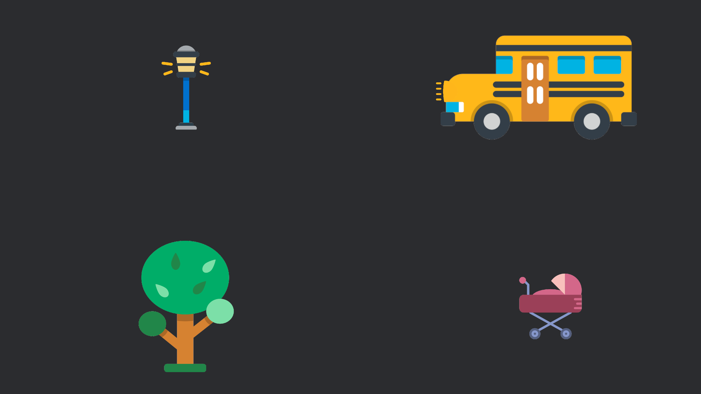

# bevy_playground
A playground for various projects / plugins and libraries developed using the bevy game engine.

## ECS Basics 1

ECS tutorial on Entities, Components, Systems, Bundles, Basic 1D Movement and Toggling visibilities.

## ECS Basics 2

ECS tutorial on Timers, Adding/Removing components, Collision Detection and Despawning entities.

## ECS Basics 3

ECS tutorial on Kinematics (Acceleration and Drag), 2d Character Movement using Keyboard/Mouse inputs, and character shooting using Mouse input.

